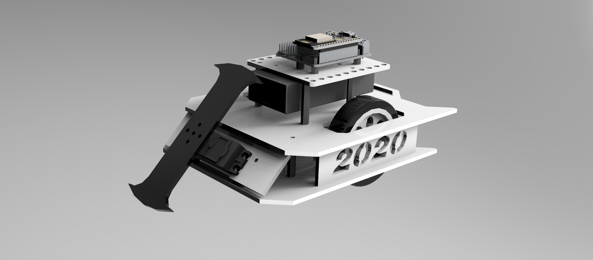

<h1 align="center"><a>- Mini Battlebot 2020 -</a></h1>

   </a>
   </a>
   </a>
   </a>

  <a href="README.md">English</a> |
  繁體中文

這是一臺使用NodeMCU ESP8266開發板作爲核心的遙控戰鬥機器人，使用Blynk作爲其控制端，只需將機器人連上Wi-Fi，即可進行遠端操控。

## 開始製作

- 創造自己的機器人 [CAD](cad/README_CN.md)
- 寫入程式 [Arduino Code](firmware/README_CN.md)
- 控制端設置 [Blynk配置](blynk/README_CN.md)
