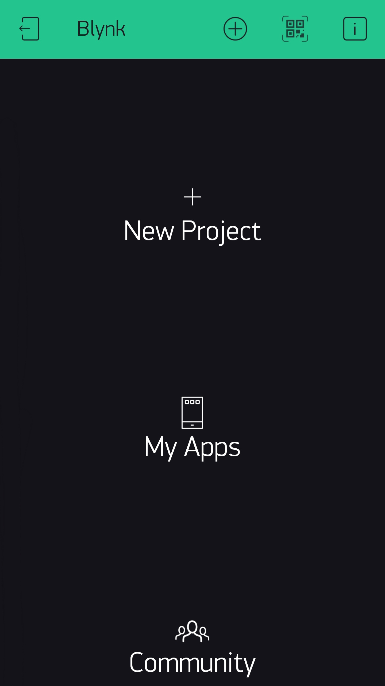

# 設置您的Blynk控制端

  <a href="README_EN.md">English</a> |
  繁體中文

在寫入控制程式後，我們將需要設置手機上的[Blynk APP](https://blynk.io/en/getting-started)([IOS](https://itunes.apple.com/us/app/blynk-iot-for-arduino-esp32/id808760481?mt=8),[Android](https://play.google.com/store/apps/details?id=cc.blynk&hl=en_US))，用來作爲Mini Battlebot遠端控制中的控制端。

## 建立New Project

在Blynk APP安裝完成之後，請您將它開啓並**注冊**或**登錄**，若登錄成功您將會看到以下畫面👇

**請點擊右上方的QR Code ICON**

## 

接下來您將看到以下畫面👇

以下有兩種方式進行操作
- 掃描下方的QR Code
- 匯入QR Code[圖檔](../docs/images/blynk003.jpg)(點擊右上方**文件ICON**)

## 下一步

寫入程式 [Arduino Code](../firmware/README.md)
